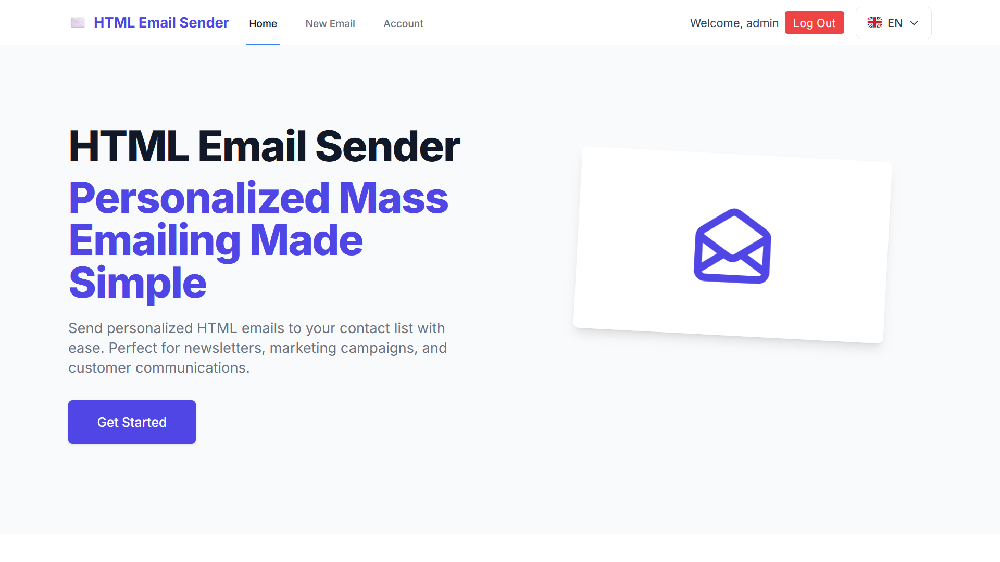

<div align="center">

# HTML Email Sender 📧

A modern, feature-rich Next.js application for composing and sending HTML emails with an intuitive user interface and powerful mailing list management. All configurations are stored securely in your browser, with no server setup required.

[](https://nextjs.org/)
[](https://www.typescriptlang.org/)
[](https://tailwindcss.com)
[](https://nodejs.org)
[](LICENSE)

> ⚠️ **Security Note**: This application is designed for local use or deployment in controlled environments. Public deployment is not recommended due to the sensitive nature of email sending capabilities.

[Features](#✨-features) | [Getting Started](#🚀-getting-started) | [Documentation](#📚-documentation) | [Contributing](#👥-contributing)



</div>

## 🎯 Key Features at a Glance

- 📝 **Visual Email Builder** with drag-and-drop interface powered by GrapeJS
- 📊 **Contact Management** with import/export capabilities
- 💾 **Template System** for reusable email designs
- 🔒 **Local Storage** for enhanced security
- 🎨 **Modern UI/UX** with responsive design
- 🔧 **Multi-Account Support** for different SMTP configurations

## ✨ Features

### 📝 HTML Email Composition
- **Visual Email Builder**
  - Drag-and-drop interface for easy email design
  - Real-time preview of email content
  - Pre-built components
  - Responsive email templates
  - No coding required

### 👥 Mailing List Management
- **Comprehensive Contact Management**
  - Create and edit recipient lists
  - Import/export functionality (CSV)
  - Personalize emails with contact fields

## 🚀 Getting Started

1. **Clone the repository**
   ```bash
   git clone https://github.com/yourusername/html-email-sender.git
   cd html-email-sender
   ```

2. **Install dependencies**
   ```bash
   npm install
   ```

3. **Run the development server**
   ```bash
   npm run dev
   ```

4. **Open your browser**
   Navigate to [http://localhost:3000](http://localhost:3000)

## 📚 Documentation

### Template Management
- **Save Templates**
  - Create templates using the drag-and-drop builder
  - Save and reuse email designs
  - Use variables in templates for personalization
  - Preview templates before use
  - Export templates for backup

### Contact Management
- **Address Book**
  - Add and organize contacts with custom fields
  - Create contact groups for easier sending
  - Import contacts from CSV files
  - Export your contact list for backup
  - Use contact fields in email templates

### SMTP Configuration
- **Email Service Setup**
  1. Navigate to Account Settings
  2. Click "Add New Account"
  3. Enter your SMTP details:
     - Name (e.g., "John Doe")
     - Email (your email address)
     - Password (your email password or app-specific password)
     - SMTP Server (e.g., smtp.gmail.com)
     - Port (usually 587 for TLS)

- **Common SMTP Settings**
  | Service       | Server           | Port | Security |
  |--------------|------------------|------|-----------|
  | Gmail        | smtp.gmail.com   | 587  | TLS      |
  | Outlook      | smtp.office365.com| 587 | TLS      |
  | Yahoo Mail   | smtp.mail.yahoo.com| 587| TLS      |
  | Amazon SES   | (Custom URL)     | 587  | TLS      |

### Security Best Practices
- Use app-specific passwords for Gmail and other services
- Enable 2FA on your email accounts
- Keep your templates and contact lists backed up

## ❗ Troubleshooting

### Common Issues

1. **SMTP Connection Failed**
   - Verify your SMTP credentials
   - Check if your email provider requires an app-specific password
   - Ensure your email service allows SMTP access

2. **Template Rendering Issues**
   - Clear browser cache
   - Check HTML syntax
   - Verify CSS compatibility
   - Try rebuilding the template using the drag-and-drop editor
   - Export and reimport the template

3. **Import/Export Problems**
   - Ensure CSV files are properly formatted
   - Check file encoding (UTF-8 recommended)
   - Verify required columns are present

4. **Email Builder Issues**
   - Clear browser cache and reload
   - Check if all components are loading properly
   - Verify image URLs are accessible
   - Try using a different browser
   - Check console for any JavaScript errors

## 🤝 Contributing

Contributions are welcome! Please feel free to submit a Pull Request.

## 📄 License

This project is licensed under the MIT License - see the [LICENSE](LICENSE) file for details.

## 💁 Support

If you encounter any issues or have questions, please:
1. Check the [Issues](https://github.com/Will6855/html-email-sender/issues) page
2. Create a new issue if your problem isn't already listed
3. Provide as much detail as possible about your setup and the issue
4. Include screenshots if the issue is related to the email builder

## 🙏 Acknowledgments

- [Next.js](https://nextjs.org/) - The React Framework
- [GrapeJS](https://grapesjs.com/) - Web Builder Framework
- [Nodemailer](https://nodemailer.com/) - Email sending functionality
- [Tailwind CSS](https://tailwindcss.com/) - Styling framework

---

<div align="center">
Made with ❤️ by Will6855

[Report Bug](https://github.com/Will6855/html-email-sender/issues) · [Request Feature](https://github.com/Will6855/html-email-sender/issues)
</div>
